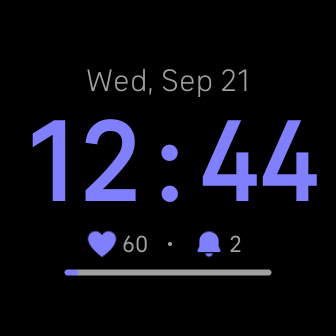

## About The Project

Inspiration comes from the audio record "The Strangest Secret" (1956) by Earl Nightingale, which teaches that periodically reminding yourself about the desired goal for some time (e. g. 30 days), will yield the desired outcome. Set your goal duration, and how often you want a reminder, and choose a unique vibration pattern. Then be disciplined enough to spend a few quality seconds truly feeling as if your goal already came true when a reminder goes off.

This Fitbit ClockFace is stats-heavy and can display information about your heart rate and daily activities. Under the displayed time, you can find two distinct sets of data. On the left side, you can rotate through your daily activity metrics and heart rate. On the right side, you can adjust your reminder behavior as follows:

- The "solid bell" icon indicates that the reminder triggers when you are awake and the number next to it shows how many times you were reminded since 5 o'clock in the morning (the hour when the reminder counter resets to zero).
- The "crossed bell" icon indicates that the reminder is off.
- The "zzz bell" icon indicates that the reminder triggers on set frequency even when you are asleep.
- The "checkmark board" icon shows how many days you've completed.

Note! If permission to "Sleep" is not granted, the reminder is triggered only between 7 o'clock in the morning and 21 o'clock (9 PM) in the evening.

The ClockFace requests permissions for the following:

- "Heart Rate" to be able to display your current heart rate.
- "Activity" to be able to display information about steps, activity zone, calories burned, etc.
- "Sleep" to be able to determine when you are sleeping and avoid disrupting your sleep with reminders.

None of the information is collected in any way or shared with third parties. All your personal data stays ONLY on your Fitbit device.

## Getting Started

Clone the repository and install all the dependencies locally with `npm run install` command. From here you can use Fitbit CLI to build and install the ClockFace either into emulator or your device.

## Contributing

Contributions are what make the open source community such an amazing place to learn, inspire, and create. Any contributions you make are **greatly appreciated**.

If you have a suggestion that would make this better, please fork the repo and create a pull request. You can also simply open an issue with the tag "enhancement".
Don't forget to give the project a star! Thanks again!

1. Fork the Project
2. Create your Feature Branch (`git checkout -b feature/AmazingFeature`)
3. Commit your Changes (`git commit -m 'Add some AmazingFeature'`)
4. Push to the Branch (`git push origin feature/AmazingFeature`)
5. Open a Pull Request